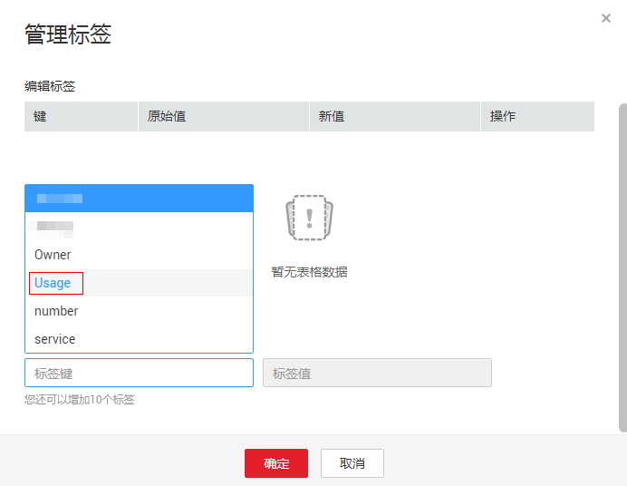

# 创建预定义标签

您可以通过预定义标签快速标识云资源，创建可参考以下操作步骤。

1.  登录管理控制台。
2.  选择“管理与监管 \> 标签管理服务”，进入标签管理服务界面。
3.  单击“预定义标签”，进入预定义标签管理页面。
4.  单击“创建标签”。

    系统进入“创建标签”页面。

5.  设置标签的“键”和“值”。
6.  单击“确定”。

    预定义标签创建完成，预定义标签列表展示新创建的预定义标签。

## 后续处理

为云资源添加标签时，在标签输入框的下拉列表中可直接选择已创建的预定义标签，无需输入标签的“键”与“值”。

例如，已创建预定义标签，其键为“Usage”，值为“Project1”，后续为某个云资源设置“键”与“值”时，页面会出现已创建的预定义标签，如[图1](#fig88681839125615)所示，直接选择即可。

**图 1**  示例  

