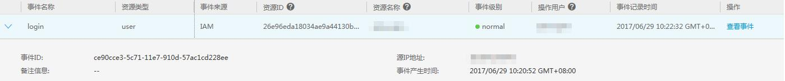
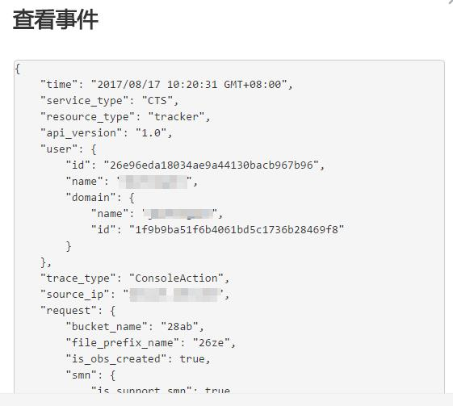

# 查看审计日志

## 操作场景

在您开启了云审计服务后，系统开始记录云服务资源的操作。云审计服务管理控制台保存最近7天的操作记录。

本节介绍如何在云审计服务管理控制台查看或导出最近7天的操作记录。

> **说明：**   
>您还可以通过云审计服务配置标签管理服务的关键操作通知，这些关键操作发生时将通过消息通知服务实时向相关订阅者发送通知。配置关键操作通知请参见《云审计服务用户指南》的[“配置关键操作通知”](https://support.huaweicloud.com/qs-cts/zh-cn_cts_01_0001.html)章节。  

## 操作步骤

1.  登录管理控制台。
2.  在管理控制台左上角单击图标，选择区域和项目。
3.  单击“服务列表”，选择“管理与部署 \> 云审计服务”，进入云审计服务信息页面。
4.  单击左侧导航树的“事件列表”，进入事件列表信息页面。
5.  事件列表支持通过筛选来查询对应的操作事件。当前事件列表支持四个维度的组合查询，详细信息如下：

    -   事件来源、资源类型和筛选类型。

        在下拉框中选择查询条件。

        其中筛选类型选择事件名称时，还需选择某个具体的事件名称。

        选择资源ID时，还需选择或者手动输入某个具体的资源ID。

        选择资源名称时，还需选择或手动输入某个具体的资源名称。

    -   操作用户：在下拉框中选择某一具体的操作用户，此操作用户指用户级别，而非租户级别。
    -   事件级别：可选项为“所有事件级别”、“normal”、“warning”、“incident”，只可选择其中一项。
    -   时间范围：可选择查询最近七天内任意时间段的操作事件。

1.  在需要查看的事件左侧，单击展开该记录的详细信息。

    **图 1**  展开记录  
    

2.  在需要查看的记录右侧，单击“查看事件”，弹出一个窗口显示了该操作事件结构的详细信息。

    **图 2**  查看事件  
    

